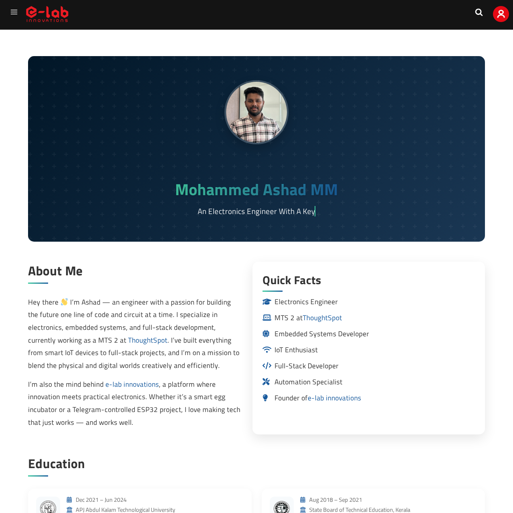

# Elabins Portfolio Blocks

A WordPress Gutenberg plugin that creates beautiful, interactive portfolio blocks with GitHub statistics integration.

[](https://wordpress.org/plugins/elabins-portfolio-blocks/)
[](https://github.com/e-labInnovations/elabins-portfolio-blocks/releases)
[](LICENSE)
[](http://makeapullrequest.com)



## Features

- 🎨 Modern, responsive portfolio layout
- 📊 Real-time GitHub statistics integration
- 🔄 Automatic hourly GitHub stats updates
- ✨ Animated sections with AOS
- 📱 Mobile-friendly design
- 🎯 Interactive tooltips
- 📊 Dynamic charts for GitHub data
- 🎨 Beautiful project showcases
- 👥 Team collaboration display
- 🏆 Awards and honors section

## Installation

### From Releases

1. Download the latest release from the [releases page](https://github.com/e-labInnovations/elabins-portfolio-blocks/releases)
2. Go to WordPress admin > Plugins > Add New
3. Click "Upload Plugin" and select the downloaded zip
4. Activate the plugin

### From Source

1. Clone this repository
2. Install dependencies: `npm install`
3. Build the plugin: `npm run build`
4. Run `npm run zip-plugin` to create the plugin zip file
5. Upload the zip file to WordPress

## Usage

1. Create or edit a page/post
2. Add the "Portfolio 01" block
3. Configure the JSON data URLs in block settings:
   - Portfolio Data URL: Your portfolio data JSON file
   - GitHub Stats URL: Your GitHub statistics JSON file

### Sample Data

The plugin includes sample data files that you can use to test:

```
/wp-content/plugins/elabins-portfolio-blocks/assets/sample-data/portfolio-data.json
/wp-content/plugins/elabins-portfolio-blocks/assets/sample-data/github-stats.json
```

Click the "Use Sample Data" button in the block settings to load these files.

## GitHub Stats Integration

The plugin uses a GitHub Action to automatically update GitHub statistics. Here's how to set it up:

### 1. Repository Setup

1. Fork this repository
2. Go to your forked repository's Settings > Secrets and variables > Actions
3. Add a new repository secret:
   - Name: `GITHUB_TOKEN`
   - Value: Your GitHub token (only needed for GitHub Actions, not for local testing)
   - Note: The repository's default `GITHUB_TOKEN` should work fine for most cases

### Local Testing (Optional)

1. Copy `.env.example` to `.env`
2. Create a new Personal Access Token:
   - Go to [GitHub Personal Access Tokens](https://github.com/settings/tokens)
   - Click "Generate new token (classic)"
   - Give it a descriptive name (e.g., "Portfolio Stats Local Testing")
   - Select scopes:
     - `repo` (Full control of private repositories)
     - `read:user` (Read all user profile data)
   - Copy the generated token (starts with `ghp_`)
3. Add your token to `.env`:
   ```env
   GITHUB_TOKEN=your_token_here
   ```
4. Run the stats generator:
   ```bash
   npm run gen-stats your_github_username
   ```

This will generate a json file like `your_github_username-profile.json`

If you get a "other side closed" error:

- Verify your token is valid and not expired
- Check that you've copied the entire token
- Ensure the token has the required permissions
- Try generating a new token

## Portfolio Data Schema

Your portfolio data should follow this structure:

```json
{
  "profile": {
    "name": "Your Name",
    "title": "Your Title",
    "about": ["First paragraph about you", "Second paragraph if needed"],
    "profile_image": "URL to your profile image",
    "facts": [
      {
        "icon": "fas fa-code",
        "content": "Full Stack Developer"
      }
    ]
  },
  "projects": [
    {
      "name": "Project Name",
      "description": "Project Description",
      "links": {
        "github": "GitHub URL",
        "website": "Live Demo URL"
      },
      "media": {
        "images": ["Image URL 1", "Image URL 2"],
        "videos": ["Video URL 1"]
      },
      "collaborators": [
        {
          "name": "Collaborator Name",
          "link": "Profile URL"
        }
      ],
      "startDate": "2024-01-01",
      "endDate": null,
      "skills": ["React", "Node.js"]
    }
  ],
  "techStack": [
    {
      "name": "React",
      "link": "https://reactjs.org",
      "image": "URL to icon"
    }
  ]
}
```

See [data-schema.json](assets/sample-data/data-schema.json) for the complete schema with all available fields.

## Development

### Prerequisites

- WordPress 6.0+
- Node.js 20+
- npm 9+

### Setup

1. Clone the repository
2. Install dependencies:

```bash
npm install
```

### Available Scripts

- `npm start` - Start development mode with hot reload
- `npm run build` - Build the plugin for production
- `npm run zip-plugin` - Create a distributable plugin zip file
- `npm run gen-stats` - Generate GitHub stats (requires `.env` setup)
- `npm run prettier` - Format code

### File Structure

```
elabins-portfolio-blocks/
├── assets/
│   ├── sample-data/
│   │   ├── portfolio-data.json
│   │   └── github-stats.json
├── build/
├── src/
│   └── blocks/
│       └── portfolio-01/
│           ├── block.json
│           ├── edit.js
│           ├── index.js
│           ├── save.js
│           ├── editor.scss
│           └── style.scss
└── elabins-portfolio-blocks.php
```

## Contributing

1. Fork the repository
2. Create your feature branch
3. Commit your changes
4. Push to the branch
5. Create a Pull Request

## License

GPL v2 or later - see the [LICENSE](LICENSE) file for details.

## Credits

Created by [Mohammed Ashad MM](https://elabins.com)

## Support

For support, please [open an issue](https://github.com/e-labInnovations/elabins-portfolio-blocks/issues) on GitHub.
